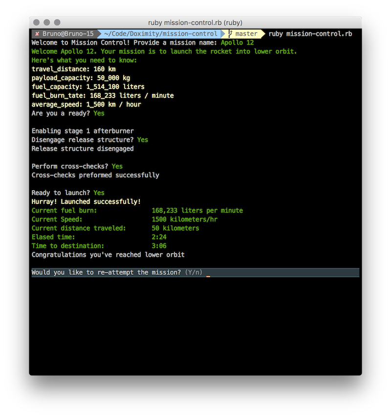
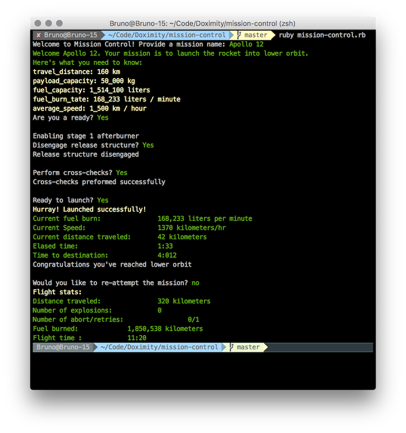

## Mission Control

We would like to thank you for taking the time to complete this assignment. We believe this to be an effective way of allowing you to show us your skills, on your own time, without the pressure of someone looking over your shoulder. Your code will be used to help us decide if we'd like to proceed with the interview process. Please understand that completing this assignment doesn't guarantee follow up interviews. We will keep you posted either way.

_Even though there is no strict time limit, it should take you 2-6 hours to complete the assignment. Have fun!_

## Launch Requirements

1. Create a Github **FORK** of this repository on your own Github account. Push your pull-request to **your own fork**. Do not push your PR to the upstream, **this is the default when creating the PR so please**. 
2. **Use Ruby**, a style guide can be found [here](https://github.com/bbatsov/ruby-style-guide), use 2 soft-tabs.
3. Use proper object orientation, abstraction and design patterns.
3. Your application should run as a CLI (command line interface). Should flow like a text based game. in memory data store is fine. The player should be able to play as many missions as they would like. At the end of each mission you should output a summary of the mission. At the end of all missions output the final summary.
4. Once completed, email your point of contact at Doximity a link to your respository.

## Your Mission

_Your mission, should you choose to accept it, is to launch our rocket into low earth orbit._

### Specifications

#### You will be responsible for conducting the flight into low earth orbit:

    1. Travel Distance: 160 kilometers
    2. Payload capacity: 50,000 kilograms including rocket itself
    3. Fuel capacity: 1,514,100 liters of fuel, already included in the payload total
    4. Burn rate: 168,233 liters per minute
    5. Average speed: 1500 kilometers/hr

#### The rocket launch system is comprised of 4 stages, that must occur in the correct order:

    1. Enabling stage 1 afterburner
    2. Disengaging release structure
    3. Cross-checks
    4. Launch

#### Mission control necessary controls

    1. Manually transition between launch stages in the expected order
    2. Mission control should be able to safely abort launch after stage 1 and retry
    3. Rocket speed should be variable up to 20% of the average speed, speed variations affect fuel burn respectively
    4. One in every 3rd launch will require an abort and retry after stage 1 (randomize)
    5. One in every 5th launch will explode (randomize)

#### Necessary instrumentation information to be provided at the end of each mission.

    1. Current fuel burn rate at select % of speed
    2. Current speed
    3. Current distance traveled
    4. Elased time
    5. Time to destination

#### Final Summary to be provided at end of all attempted missions.

    1. Total distance traveled (for all missions combined)
    2. Number of abort and retries
    3. Number of explosions
    4. Total Fuel burned (for all missions combined)
    5. Flight time (for all missions combined)

#### Sample Output

